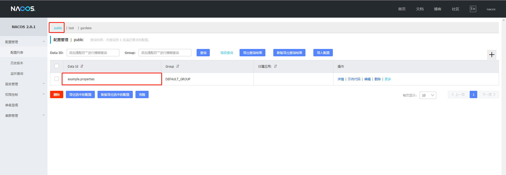

# 上线流程

## 流程


注意事项

项目上线前必须准备好数据库脚本与相关配置文件，仔细核对配置文件能大大缩短上线周期 :clap: 


.png>)

## 准备工作

### 配置文件整理


注意事项

1. 配置文件包含application.properties里面通用配置
2. 仔细对比正式环境配置项，如：redis、数据库、rabbitmq、mongodb以及相关项目配置文件 :point_right: [配置文件](profile.md#xiang-mu-pei-zhi-wen-jian)
3. 前端API接口地址如需兼容需要配置路由 :point_right: [配置文件](profile.md#hprose)
4. easy ui页面转发 :point_right: [配置文件](profile.md#easyui-)


#### 配置文件示范


注意事项

下面配置只做参考，具体配置还需要针对当前项目配置做改变。


前往测试环境查看配置 :point_right: [配置文件](profile.md#nacos)

